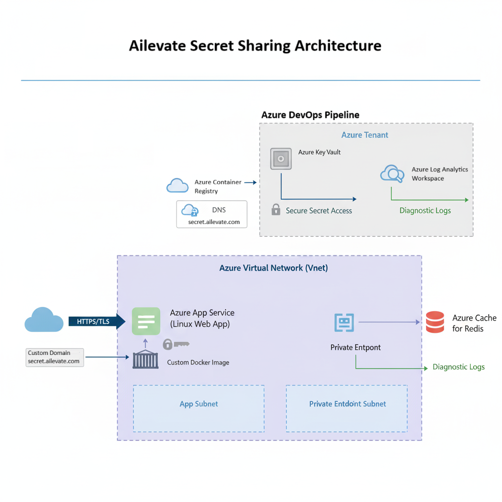

# Ailevate Secret Sharing Service
[Ailevate Secret Sharing Service](https://secret.ailevate.com) is a secure, ephemeral secret sharing service, hosted and managed entirely by Ailevate. It allows employees and customers to safely transmit secrets (e.g., API tokens, credentials) using one-time links, preventing sensitive data from being exposed in email or chat logs.

## 📌 Overview
This project deploys a private, production-ready instance of Ailevate Secret Sharing Service. The deployment is fully automated using Infrastructure as Code (Terraform) and a CI/CD pipeline (Azure DevOps)..

* ✅ **Secure**: Secrets expire after the first view or a configurable time-to-live (TTL).
* ✅ **Auditable**: All significant events are logged to a central Log Analytics workspace for security monitoring.
* ✅ **Automated**: Infrastructure is version-controlled and deployed automatically, ensuring consistency and reliability.

---
## 🏛️ Architecture
The solution is deployed to Azure and consists of the following key components:
* **Azure Container Registry**: Stores the custom-built, Ailevate-branded Docker image for the application.
* **Azure App Service**: Runs the custom Docker container on a Linux App Service Plan.
* **Azure Cache for Redis**: Provides a secure, ephemeral backend for storing secret data, secured via a **Private Endpoint**.
* **Azure Key Vault**: Securely stores and manages all application secrets.
* **Azure Virtual Network (VNet)**: Isolates all application components.
* **Azure DNS**: Manages the custom domains (e.g., `secret.ailevate.com`) and the managed TLS certificates.
* **Azure Log Analytics**: A central workspace that collects diagnostic logs and metrics.



---
## 📖 How to Use the Service
Using the Ailevate Secret Sharing Service is a simple, secure process.

#### 1. Set Your Secret
Navigate to the service URL: **[https://secret.ailevate.com](https://secret.ailevate.com)**. Enter the secret you wish to share into the text box, select an expiration time, and click "Generate Secure Link".


-
#### 2. Share the Secure Link
The application will generate a unique, one-time use link. Copy this link and send it to your intended recipient.


-
#### 3. Recipient Previews the Secret
When the recipient clicks the link, they are first shown a confirmation page. This is a final warning that the secret can only be viewed once and will be permanently destroyed after viewing.


-
#### 4. Secret is Revealed
After clicking "View Secret Now," the recipient is shown the secret. At this moment, the link is invalidated, and the data is permanently deleted from the server.


-
#### 5. Link is Destroyed
If anyone (including the original recipient) tries to visit the link again, they will see a confirmation that the secret has been destroyed and can no longer be accessed.


---
## 🤖 API Usage
The Ailevate Secret Sharing Service has 2 APIs:
1.  A **Simple API** that can be used to create secret links and then share them with users.
2.  A **REST API** which facilitates programmatic interactions without having to parse HTML content.

### Simple API
The advantage of using the simple API is that you can create a secret and retrieve the link without having to open the web interface. This is useful for embedding in simple scripts.

To create a secret, send a POST request to `/api/set_password` like so:
```
$ curl -X POST -H "Content-Type: application/json"  -d '{"password": "password"}' https://secret.ailevate.com/api/set_password/
```
This will return an HTML response with the secret link.
```
{
  "link": "https://secret.ailevate.com/ailevate498110a342ec49b49e9f4126d3838c25~9OoI0oSd0bGGuYObPiIlEywaSSfljZ16JS0Xo9Tz4hk%3D",
  "ttl": 1209600
}
```
The default TTL is 2 weeks (1209600 seconds), but you can override it by adding an expiration parameter:
```
-d '{"password": "password", "ttl": 3600 }'
```
If the secret is empty or the TTL is larger than 1209600, the server will return a 500 error.

### REST API
The advantage of using the REST API is that you can fully manage the lifecycle of the secret without having to interact with any web user interface. This is ideal for embedding in a script, a CI/CD pipeline, or sharing between multiple client applications.

#### Create a Secret
To create a secret, send a POST request to /api/v2/passwords like so:
```
$ curl -X POST -H "Content-Type: application/json"  -d '{"password": "password"}' https://secret.ailevate.com/api/v2/passwords
```
This will return a JSON response with a token and the secret link:
```
{
  "links": [
    {
      "href": "https://secret.ailevate.com/api/v2/passwords/ailevate1f1e878bb69a401eb4eccb36630ce607~iYaMQuZ7DBTmmssNqWGHFwZTBpfg1yHwvCYUsdCf42w%3D",
      "rel": "self"
    },
    {
      "href": "https://secret.ailevate.com/ailevate1f1e878bb69a401eb4eccb36630ce607~iYaMQuZ7DBTmmssNqWGHFwZTBpfg1yHwvCYUsdCf42w%3D",
      "rel": "web-view"
    }
  ],
  "token": "ailevate1f1e878bb69a401eb4eccb36630ce607~iYaMQuZ7DBTmmssNqWGHFwZTBpfg1yHwvCYUsdCf42w=",
  "ttl": 1209600
}
```
The default TTL is 2 weeks (1209600 seconds), but you can override it by adding an expiration parameter as mentioned above.

If the secret is empty or or the TTL is larger than 1209600, the server will return a 400 error with a response similar to this:
```
{
  "invalid-params": [
    {
      "name": "password",
      "reason": "The password is required and should not be null or empty."
    },
    {
      "name": "ttl",
      "reason": "The specified TTL is longer than the maximum supported."
    }
  ],
  "title": "The password and/or the TTL are invalid.",
  "type": "https://secret.ailevate.com/set-password-validation-error"
}
```

#### Check if a secret exists
To check if a secret exists, without retrieving it, send a HEAD request to `/api/v2/passwords/<token>` like this:
```
$ curl --head https://secret.ailevate.com/api/v2/passwords/ailevate1f1e878bb69a401eb4eccb36630ce607~iYaMQuZ7DBTmmssNqWGHFwZTBpfg1yHwvCYUsdCf42w%3D
```
If the secret exists, the API will return a 200 response, otherwise the API will return a 404.

#### Read a secret
To retrieve a secret, send a GET request to `/api/v2/passwords/<token>` like this:
```
$ curl -X GET https://secret.ailevate.com/api/v2/passwords/ailevate1f1e878bb69a401eb4eccb36630ce607~iYaMQuZ7DBTmmssNqWGHFwZTBpfg1yHwvCYUsdCf42w%3D
```
If the token is valid the API will return a 200 with the following response:
```
{
  "password": "password"
}
```
Otherwise the API will return a 404, like so:
```
{
  "invalid-params": [
    {
      "name": "token"
    }
  ],
  "title": "The password doesn't exist.",
  "type": "https://secret.ailevate.com/get-password-error"
}
```

### Notes on APIs
* When using the APIs, you can specify any TTL, as long as it is lower than the default.
* The secret is passed in the body of the request rather than in the URL. This is to prevent the secret from being logged in the server logs.

---
## 🔒 Security
* **Encryption**: All traffic is encrypted in transit using TLS 1.2. Data is encrypted at rest in Azure Cache for Redis and Azure Key Vault.
* **Secret Management**: No secrets are stored in code or pipeline variables. They are generated on first deployment and stored in Azure Key Vault. The App Service uses its Managed Identity to securely access secrets at runtime.
* **Network Isolation**: All components are isolated within a VNet. The Redis cache is only accessible via a private endpoint from within the VNet.

---
## 🎧 Support

- **Internal:** internal-support@ailevate.com
- **Owners:** sre-team
